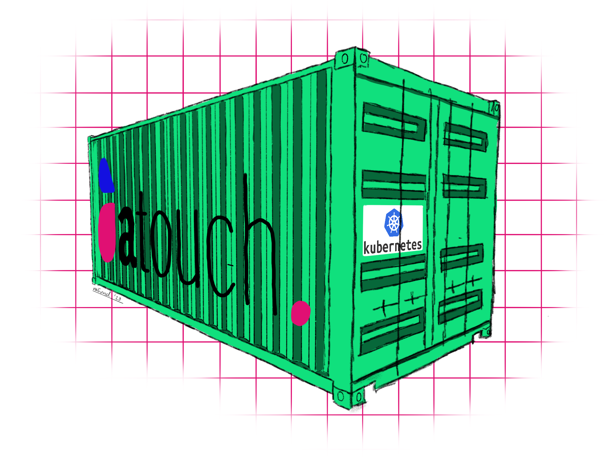
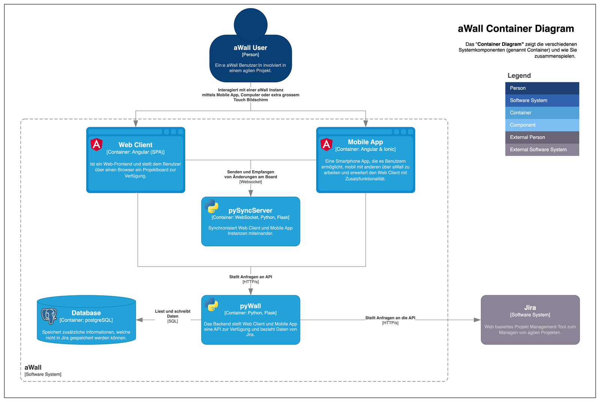
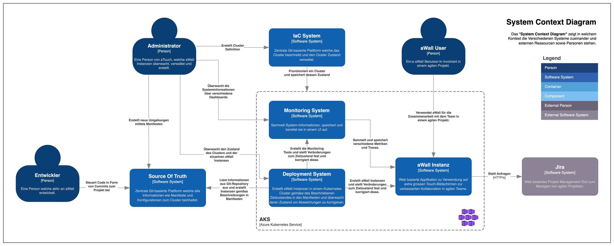
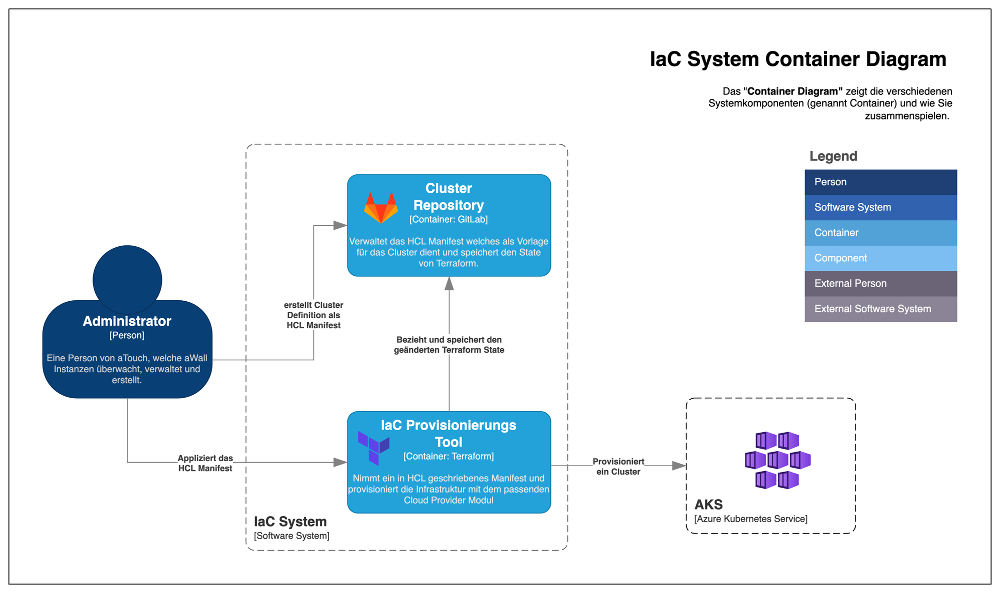
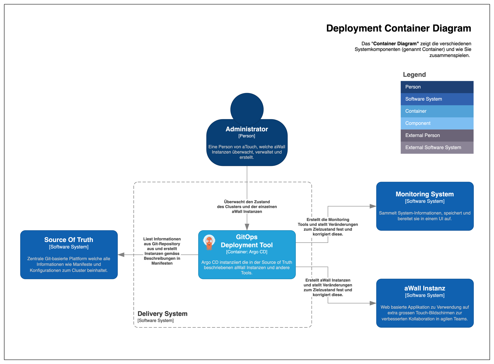
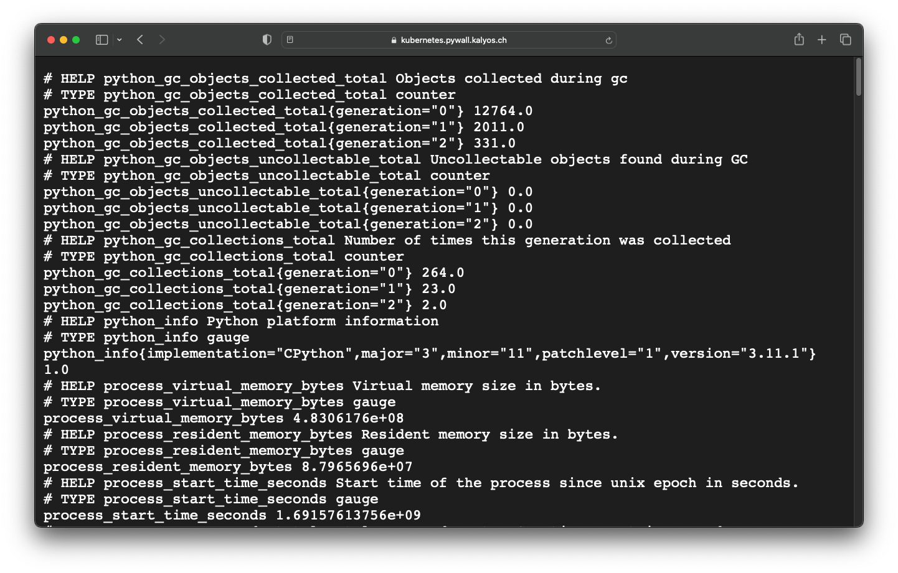
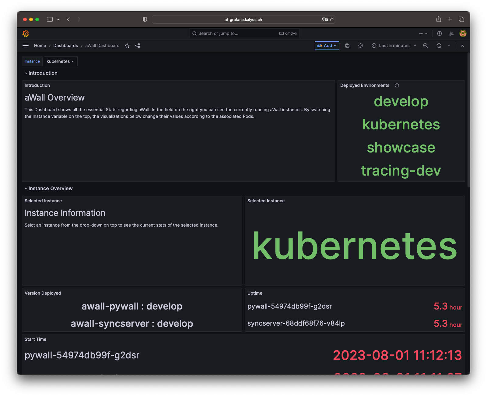
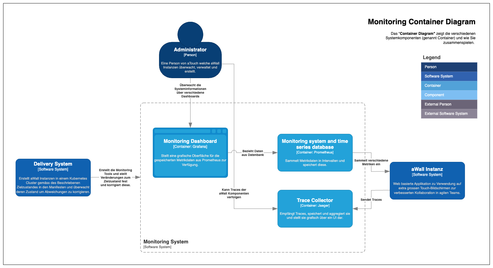

As a project for my bachelor thesis, a deployment strategy and a monitoring system for the aWall research project of the IMVS of the FHNW was developed together with a project partner in order to be able to operate aWall on a Kubernetes platform. Modern GitOps methods and tools were used for this.

## Introduction

In this blog post, I would like to present my bachelor's thesis and give a brief outline of the core topics covered.

## aWall

aWall is a research project of the Institute for Mobile and Distributed Applications at the University of Applied Sciences Northwestern Switzerland together with the company aTouch GmbH. The project aims to research agile collaboration using extra-large touchscreens. Project data from Jira is displayed on a large Kanban board, which can be controlled using touch gestures. The large screen and intuitive operation are intended to encourage agile teams to work together more constructively.

The aWall system consists of the following components:
- Web Client (Angular)
- Mobile App (Angular & Ionic)
- pySyncServer (Flask)
- pyWall (Flask)
- Database (PostgreSQL)

The aWall Container diagram shows how the system components work together.

aWall is well suited for deployment on a Kubernetes cluster due to its service architecture. Because the aWall software architecture provides a set of these 4 main components for each customer (with the exception of the mobile app), several customer instances can run in parallel on shared resources thanks to the Kubernetes cluster. Each pyWall instance is configured individually for each customer via a config map.

## Solution

In order for aWall to move away from dedicated virtual machines and Docker Compose towards a fully automated Kubernetes deployment with observability, additional subsystems are needed to make this possible. The System Context Diagram depicts the solution in its individual subsystems.

The 4 individual subsystems can be roughly summarized as follows:
- Infrastructure as Code System for provisioning the cluster
- The individual GitLab repositories required by the overall system are summarized as Source of Truth
- Deployment system which fully automatically bootstraps the cluster according to the manifests described in the Single Source of Truth
- Monitoring or observability system that provides insight into the system using metrics and traces

## IaC System

The cluster is hosted by Azure Kubernetes Service (AKS). Terraform is used to provision this in turn. The HCL script is stored in a GitLab repository, which also manages the Terraform state. This allows different developers to make changes to the cluster without any conflicts arising.

Thanks to the declarative infrastructure-as-code approach, the cluster can be set up, dismantled, repaired or duplicated as required.

## Deployment system

Once the cluster has been set up, Argo CD is installed on the cluster in its own namespace using the Helm Chart provided by the developers. The step-by-step instructions for this can be found in GitLab.

Helm describes itself as a package manager for Kubernetes and is a widely used tool for deploying applications to Kubernetes. The Kubernetes resources required for an application (e.g. containers, services or persistent volumes) can be summarized as a Helm chart and shared with other developers. Values (variables) in the original manifest can be overwritten via a YAML file in order to make adjustments or configurations.

Argo CD is a deployment tool for Kubernetes that follows a GitOps approach. In short, this means that all resources deployed in the cluster are versioned and stored as YAML manifests in a Git repository so that Argo CD can automatically and continuously deploy them in the cluster according to their configuration. This Git repository is called a single source of truth because there is only one central location in which the state of an app to be reached is described. If a deployed app deviates from the declaration described in Git, this is referred to as drift. Argo CD recognizes this drift and can react to it, i.e. correct, warn, etc. Thanks to the so-called Apps-of-Apps pattern, Argo CD continuously checks whether there have been changes in the single source of truth and if, for example, a new manifest is added for an aWall environment, Argo CD automatically creates it. The entire cluster bootstrapping, i.e. all other applications running in the cluster for monitoring, tracing or the Ingress Controller, are also created and managed via Argo CD. This makes the cluster setup relatively simple and the required Kubernetes know-how relatively small.

## Observability

In order to monitor aWall and define suitable SLOs, the individual system components are monitored via Prometheus. Prometheus calls the /metrics path of the individual components at regular intervals in order to save the latest metrics data in the time series database.

A metric is essentially a label and a numerical value. This can, for example, provide information as a counter about the number of calls or as a gauge about the current utilization. Grafana can be used to display the collected values graphically. The dashboard shown here shows how this can look.

Furthermore, aWall has a tracing system. Each system component sends a span to the trace collector as soon as a request arrives. These spans can be aggregated into traces via header information, which show how a request moves through the system. This can help to find errors more quickly in the future. Jaeger was used for aWall because it natively supports the OpenTelemetry standard and is open-source.

Observability actually also includes the orderly collection of logs. We originally tried to monitor the two Python applications using Open-Telemetry. OTel promises to provide a uniform standard for the so-called "Three Pillars of Observability" - Metrics, Logs & Traces. This manufacturer agnostic standard is still fairly new. That is why there is still a lack of documentation and instructions here and there. Certain features (for example, collecting logs with OTel and Flask) were still marked as experimental during the project. Unfortunately, we did not manage to monitor the components with auto-instrumentation and side-cars, which is why we switched to a more conventional approach.
