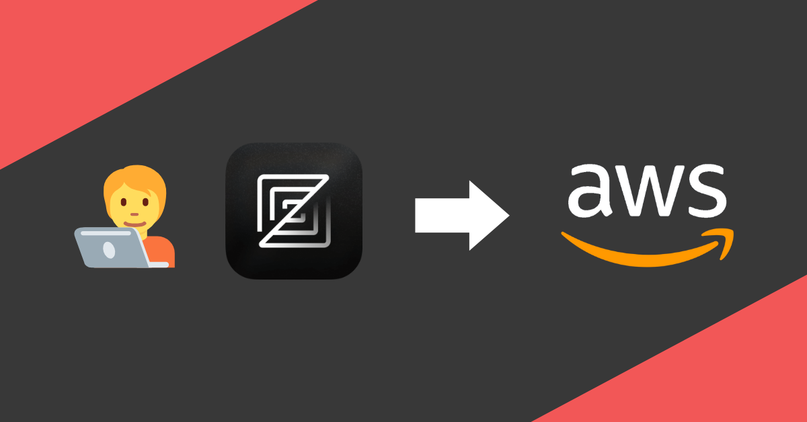

**tl;dr** Zed, a fast Rust-based code editor, now supports remote development via SSH, letting developers offload resource-heavy tasks to cloud servers like AWS EC2. This feature simplifies workflows, enables cross-device coding, and supports projects requiring specific architectures or AWS integrations. A quick setup guide outlines connecting Zed to EC2 for seamless remote coding.

## Remote Development & Zed

Memory and computing power are getting more and more affordable. Yet there are limits. Either physical or financial. Not everyone can afford a maxed-out MacBook Pro with an M4 processor and 64GB of RAM. Or doesn't want to carry around a heavy 16-inch laptop. Multiple containers alongside your IDE, a few tabs open in a Chrome-based browser, Spotify playing music and a running email client can quickly use up large parts of your system memory on an average laptop. A simple and affordable solution is using a cloud development service.

Two weeks ago Zed Industries, the company behind my favourite code editor Zed, announced a compelling remote development feature. Right now it's in Beta state, but at the pace things are moving at Zed Industries I expect it to be released in a stable version anytime soon.

[SSH Remoting is Here! - Zed Blog](https://zed.dev/blog/ssh-remoting)

I've been using Zed for quite some time now. So naturally I was very excited to test out this new feature once it was announced. How it works is very simple. Once you connect through SSH to your remote server, Zed is downloading and installing the Zed Remote Server binary. This binary works with almost all Linux distros (check documentation for compatibilities) and can even be installed straight from your local machine.

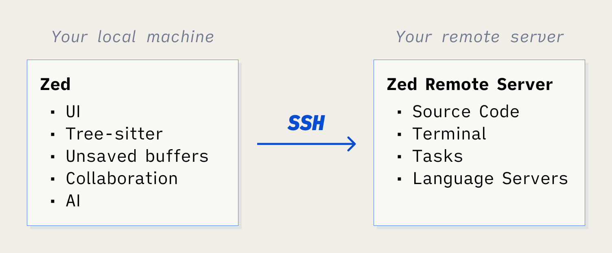

That's it. You just connect your IDE through SSH to your remote server and start coding...

### What is Zed?

Zed calls itself "_a next-generation code editor designed for high-performance collaboration with humans and AI._" Unlike VSCode, Zed isn't written in Typescript, but Rust. This makes it super fast and lightweight.

This feature opens up many possibilities. Of course, it's targeted at developers first, but there are some use cases where Cloud Engineers and Terraform coders can benefit as well.

## Possible Use-Cases

Possibilities are endless, but I can see three neat use cases where Zed remoting can be handy.

### Relieve your computer

Imagine you're developing software using a Redis cache, a PostgreSQL database and a few more periphery tools. Running many services locally can be cumbersome to maintain and abstracting them is time-intensive. If you can afford it, just "rent" an EC2 instance to host all these things for you. The beauty of cloud computing is, that we can start and stop instances on demand. If you stop coding, just stop your instance. This way the running costs can be kept fairly low. Especially in comparison to what you'd spend on maxed-out hardware or the hustle to fix connections, keep your environment up to date, and much more. Plus, you can hop on and off your remote development environment with different devices. Use your iMac at home and your ThinkPad on the go without pushing code, pulling code, initializing environments, installing tools...

### Attach a role to use AWS Services

Are you writing code with dependencies on AWS services? When using EC2 as a remote development instance, you can easily manage permissions on other AWS services by using policies attached to an IAM role assigned to the EC2 instance. Although user management with identity providers should always be the preferred way of granting system access to developers, there are many reasons this setup can be safe and productive.

### Different hardware requirements

Maybe the application you're developing is software that's running a processor architecture different to your development machine. Even though this problem is getting less and less with the rising popularity of scripting languages and containerization, you might still develop an application running on x86 while writing the code on your m4 MacBook.

Let's get practical.

## How to connect to AWS EC2 instance

In this short tutorial, I want to show you how you can set up a simple EC2 instance and run a Hello World application on it using Zed.

### Requirements

- The latest version of Zed is installed on your machine
- You have access to an AWS Account

### Create an EC2 instance

Log in to the AWS console, go to the EC2 page and launch a new instance.

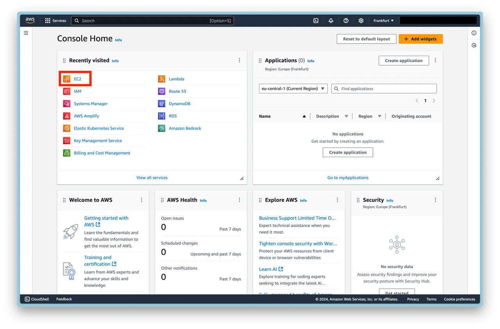

Name your instance and change the Linux image and processor architecture to your liking. For this tutorial, we're going to use the standard Amazon Linux AMI and an arm architecture-based processor.

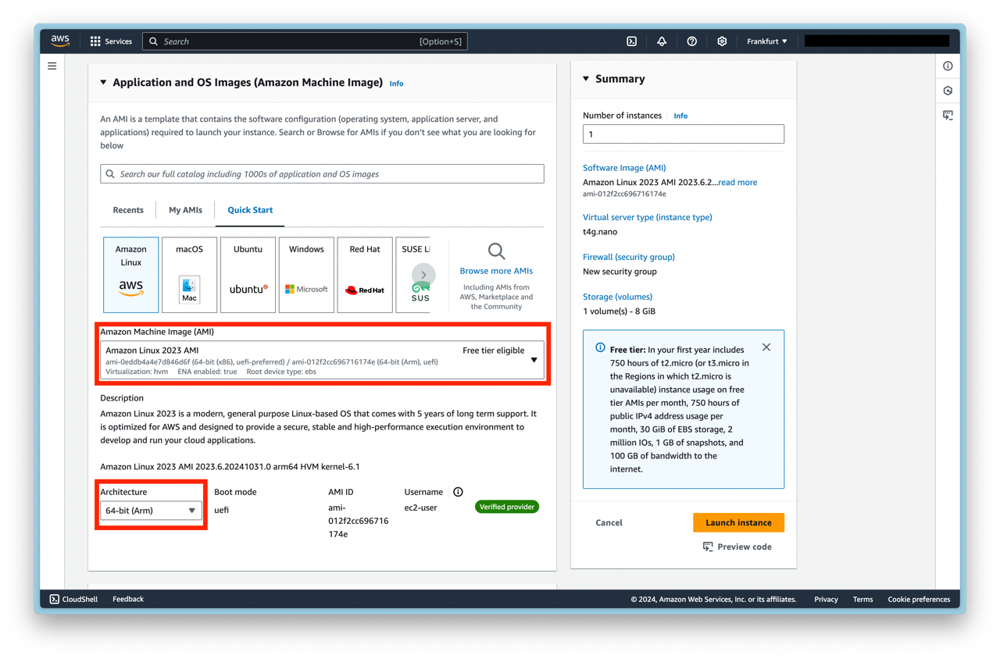

Don't forget to create or assign an SSH key pair.

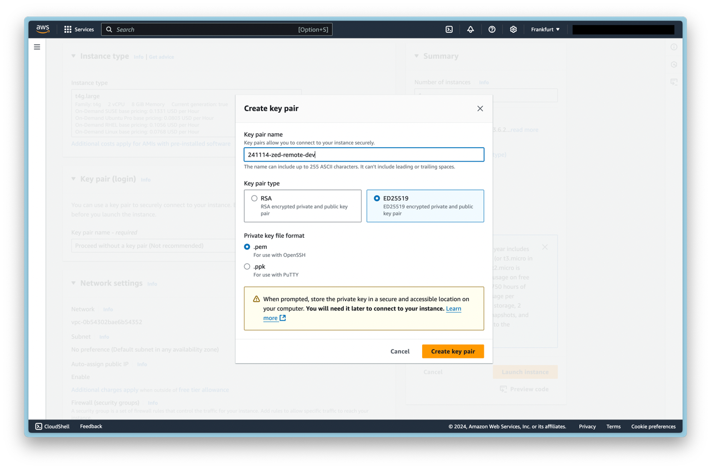

Create or select an existing security group. SSH traffic must be allowed from where you're trying to log in. Also, be sure your instance is deployed in a subnet which has internet access through a gateway and that all routes are configured accordingly. Otherwise, you might encounter issues connecting to your EC2 instance.

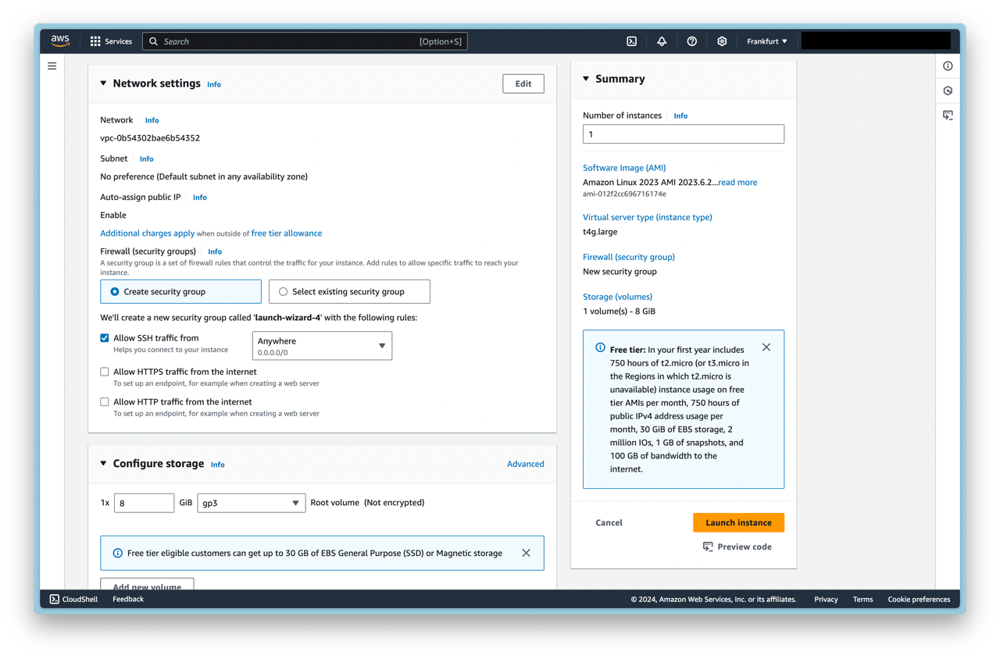

Launch the instance and wait until the instance enters the **Running** state. Copy your public IPv4 DNS record and open your terminal.

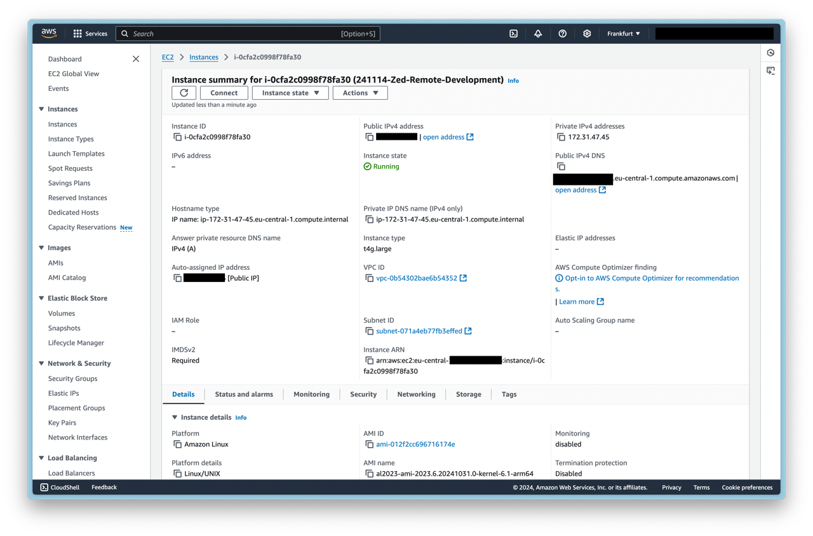

To connect to your instance, use the SSH client of your liking. We're using the default ssh client of MacOS. Try:

```bash
ssh -i SSH-KEY-FILE-LOCATION IPv4-DNS-Record
```

Once you're logged in, we create a project folder - in our case _fancy-project_ - and create a new virtual environment for Python. Additionally, we create an empty _main.py_ file. SSH works as we would expect.

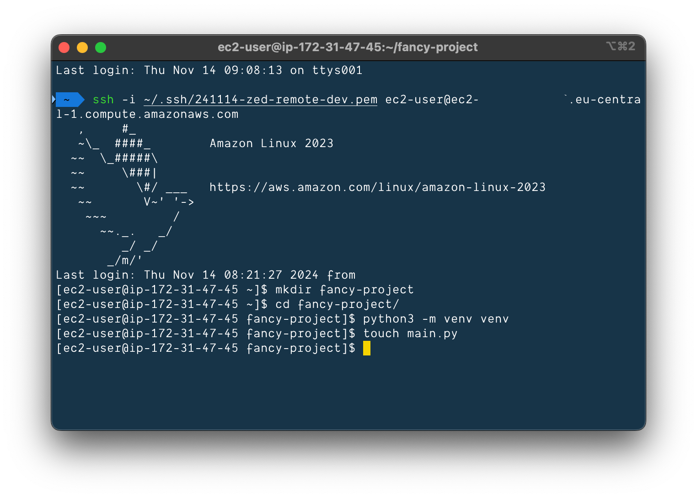

Now we copy the SSH command we just used in the terminal and open Zed. Press _^ + cmd + o_ at the same time to open the Remote Projects window. Click on _+ Connect New Server_ and paste the SSH command from before. Press enter.

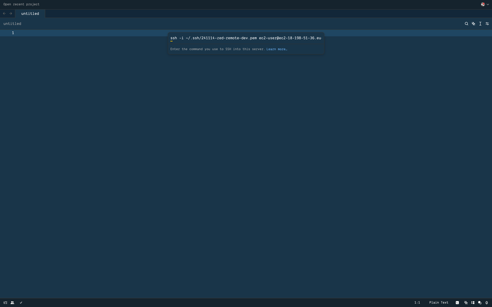

When Zed has connected successfully to your instance, it asks you to select a folder to open as a project. We choose our _fancy-project_ folder.

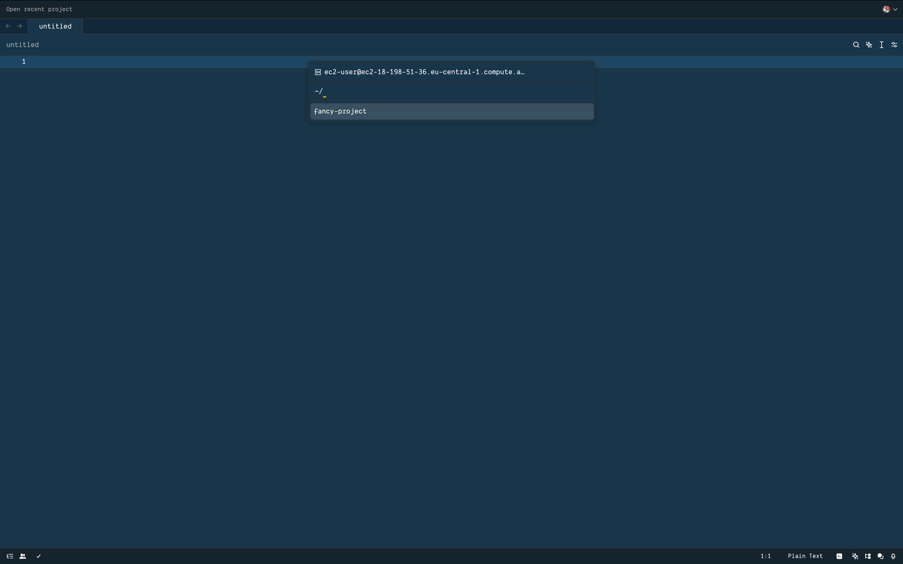

Zed is sourcing the venv automatically and we can already see our previously created _main.py_ file in the file explorer. We write a simple _hello world_ script and execute the script using the terminal.

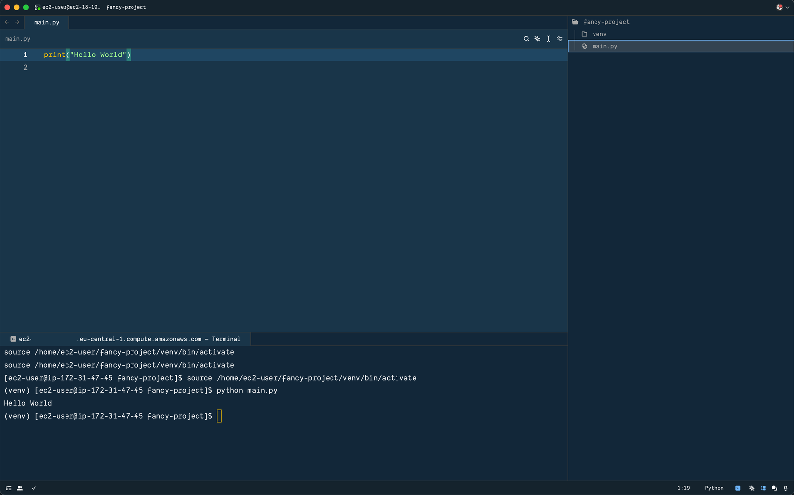

And that's how you connect Zed to your remote development instance. From here you can just develop.

## Things to consider

- Starting and stopping an EC2 Instance may result in a new IP address. Attach a fixed _Elastic IP_ to your instance to save yourself from re-configuring when restarting the VM.
- Use EC2 UserData to install dev dependencies beforehand. Update your system and install things like JVM, SKDs, docker, etc.
