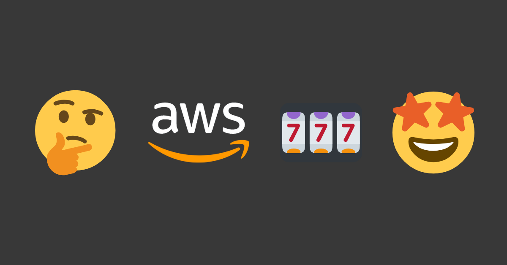

**tl;dr** We've used a gamified approach to showcase how _Retrieval Augmented Generation_ enables businesses to use _Large Language Models_ in combination with their company data. Based on the popular board game _Who-Is-It?_, we created a demo.

## Motivation

At tecRacer, we're working in a 4 + 1 model. This means working four days a week on client projects and dedicating one day to team meetings, sharing knowledge in competence centres (CC), learning for certifications or following our projects. One of these competence centres is dedicated to AI/ML topics and my colleague Chrishon is an active contributor to this group. Within this CC, he created a RAG Proof of Concept (PoC) to show customers how proprietary data can be used with Large Language Models (LLM) using AWS Generative AI (GenAI) technologies. We just had no idea yet how we could present this PoC to our customers. It was clear from the start, that we would like to build something interactive.

It's a coincidence, but not too long ago I held a box of Who-Is-It in my hands. Who-Is-It is a board game that lets two players guess a person using Yes/No questions. Each player draws a card with a face. The other person doesn't know which face their opponent has drawn. Both players use the grid of faces in front of them to narrow down who it might be.

To reduce the number of faces one should ask broader questions at the beginning like:

> Is the person male?

... and later ask for more specific details for the remaining faces, such as:

> Does the person wear glasses?

It seemed to be the ideal vehicle to showcase the RAG PoC, because it's a game based on proprietary information and language. Thus I made a quick draft and pitched it to my colleagues.

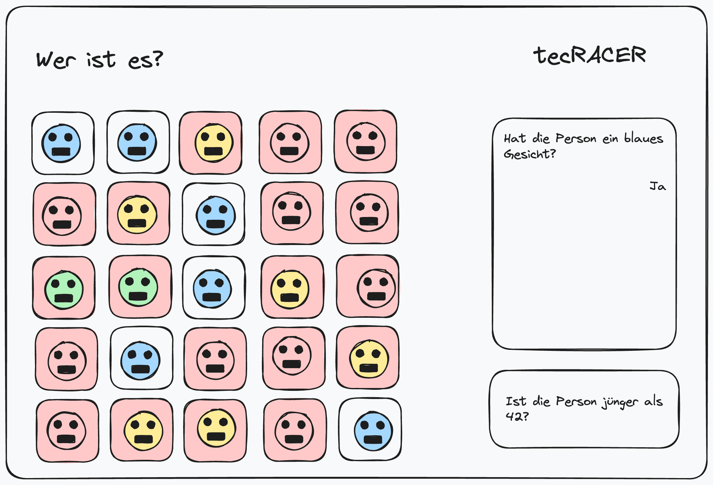

Thanks to our great team dynamic, the idea sparked a fire and together with Chrishon and Besjan we started working on a prototype.

## How Does Retrieval Augmented Generation Work?

Let's talk about Retrieval Augmented Generation (RAG for short) first. Today there's a large variety of Large Language Models (LLM) available. GPT4, Claude Sonnet, LLaMA or Gemini just to name a few. They're massive AI models capable of generating text or image output to input prompts.

There's only one issue in a business context. Such a model can only output from the data provided in the training process used to create the model. Although those models are great with publicly available information like kitchen recipes, writing style recommendations or technical documentation, they can't answer questions regarding your proprietary business data, for example, datasheets.

This is where Retrieval Augmented Generation comes into play. By extracting embeddings from your documents and storing them in a vector database, we can enrich prompts for Large Language Models with context. If you are interested in a more in-depth explanation, the popular YouTube channel Computerphile has created a great explanatory video.

## Project Architecture

The game we've built consists of three parts:
- tecRacer RAG PoC
- Who-Is-RAG Game Logic
- Who-Is-RAG Frontend

The previously mentioned RAG PoC is data agnostic. This means that the PoC indifferent to the nature of the provided content. Any document uploaded to the S3 bucket is used to generate the embeddings. The game on the left side is just overlayed. We deliberately used AWS Serverless components, because they facilitate the highly efficient creation of business logic and are very cost-effective. Thus the whole game logic is handled by a small number of AWS Lambda Functions, an SQS to make certain API calls asynchronous and a DynamoDB table to store data about the game.

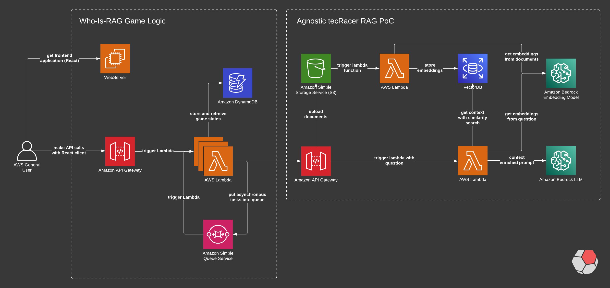

Every time a new game is started, an entry is created in DynamoDB with a session identifier, a timestamp and a randomly selected person from our dataset. This entry is updated every round by increasing the number of questions asked, the question text itself and whether a guess was made.

## Creating A Dataset

Creating a dataset for the game is easier said than done. We had to come up with something proprietary because using photographs of popular people or landmarks for example, wouldn't work. That's because most LLMs are aware of most of these things. You could say that an LLM knows almost everything about any topic that has a Wikipedia page. And much more. It's pretty clear to us that we wanted to create the dataset using AI too.

Because we knew we would like to showcase this demo at AWS events, we used only AWS Generative AI (GenAI) services. First, we tried to generate comic-like images, similar to the original game. Generating approximately 30 faces in the same artistic style is difficult. Here is a selection from the first round of queries.

|  |  |  |
| --- | --- | --- |
| 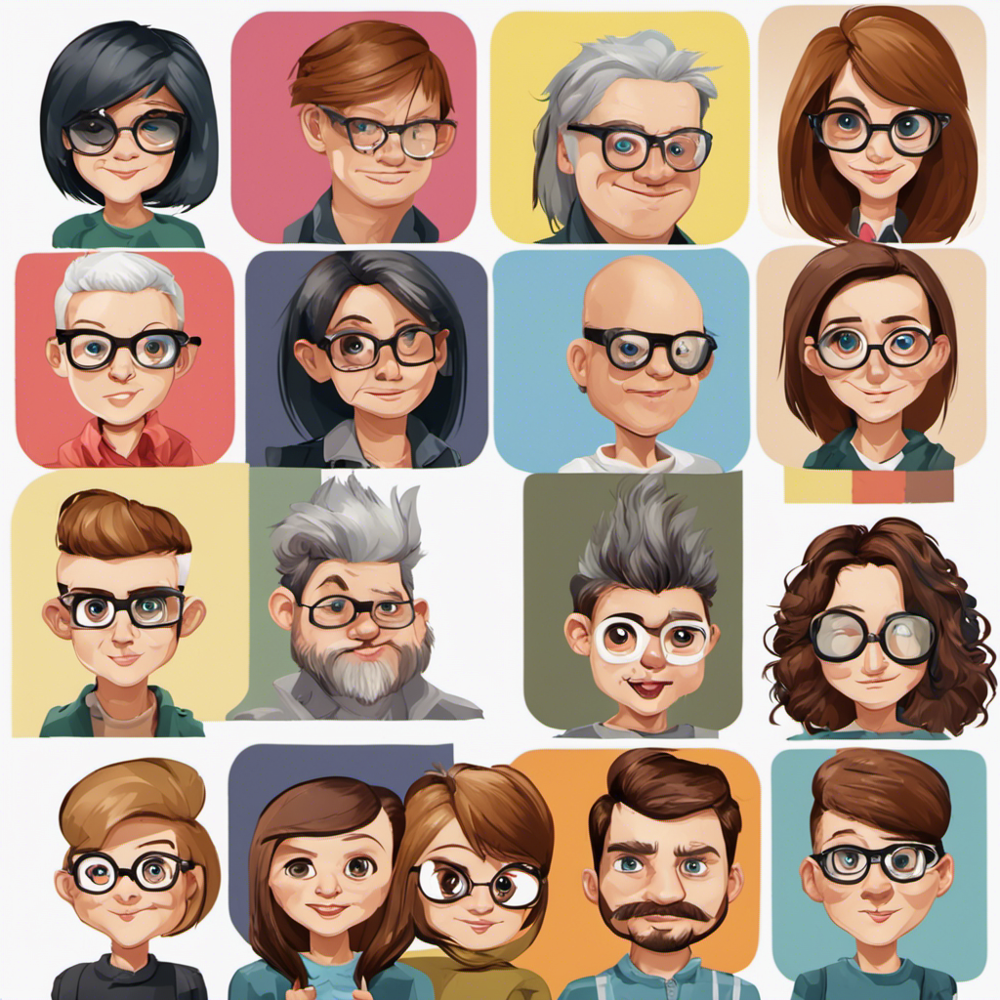 | 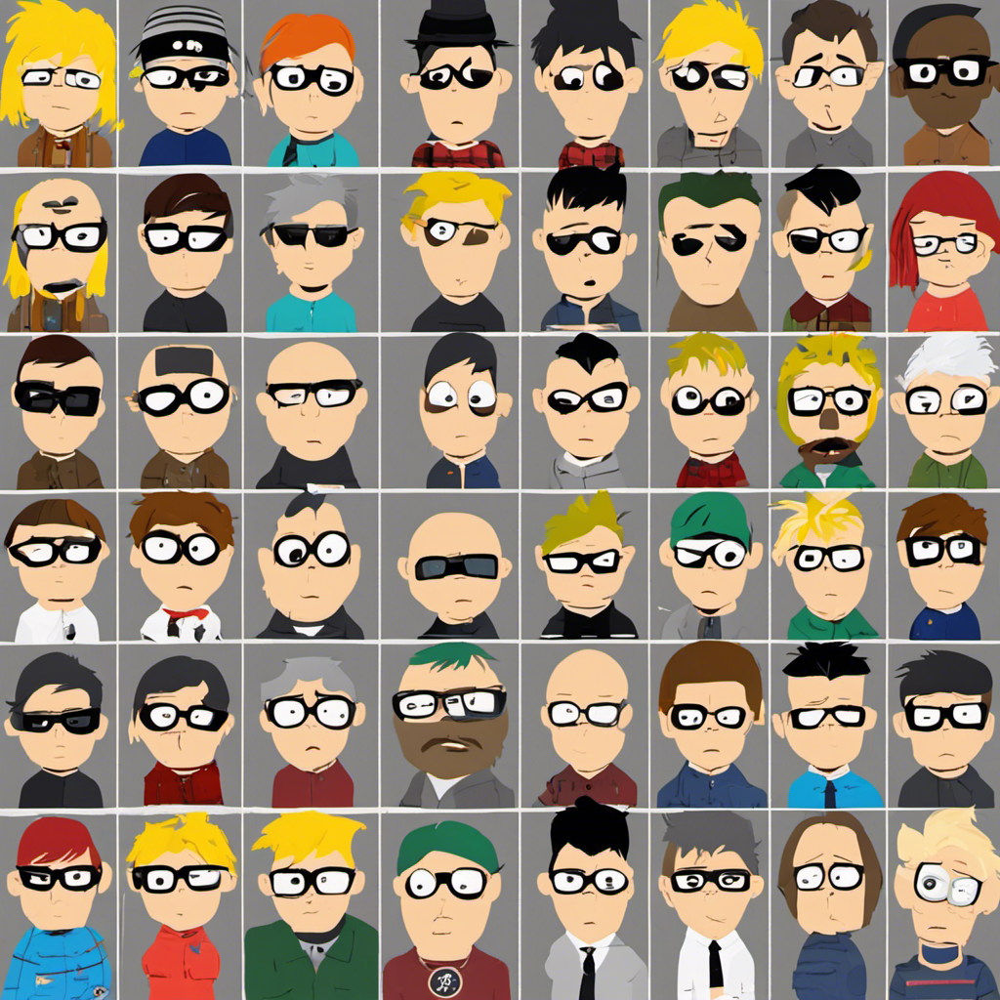 | 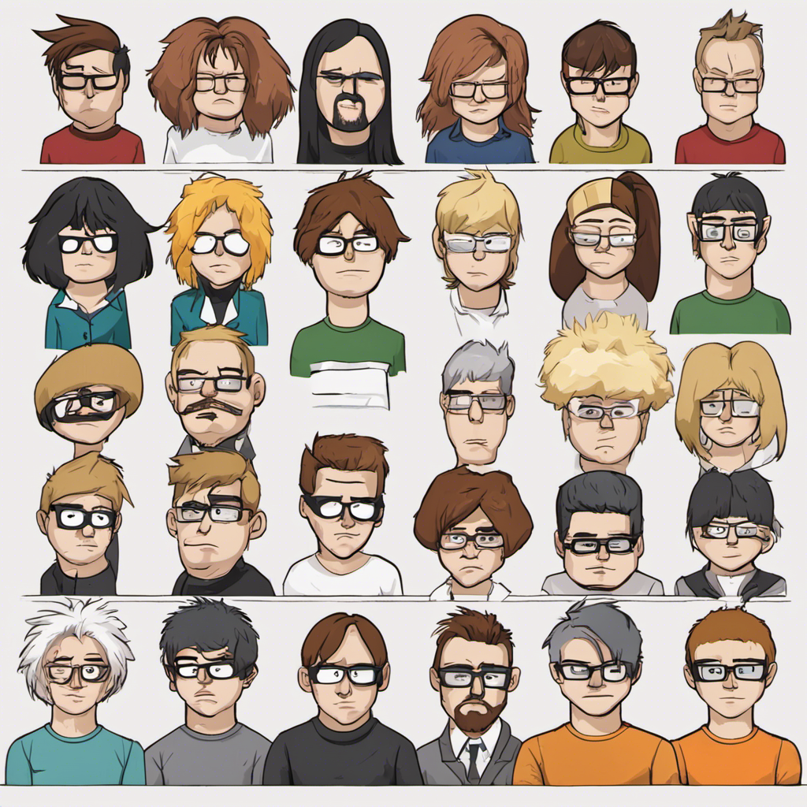 |
| 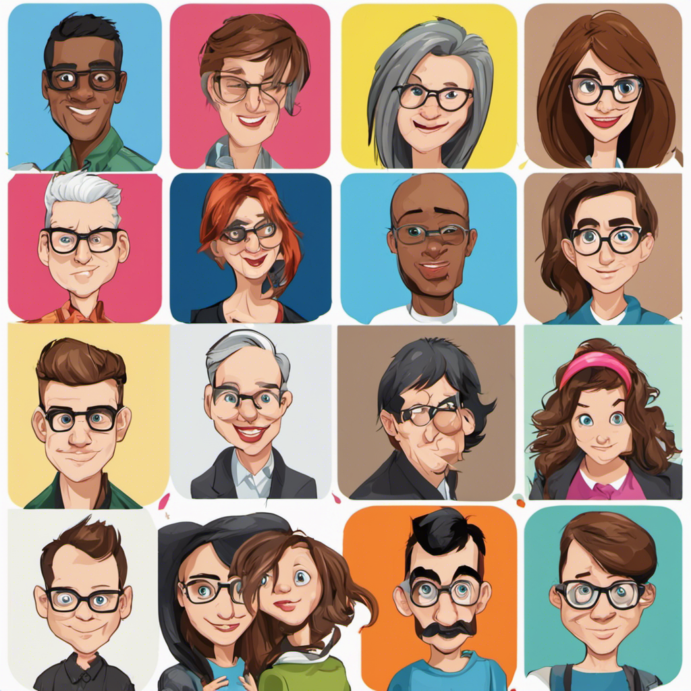 | 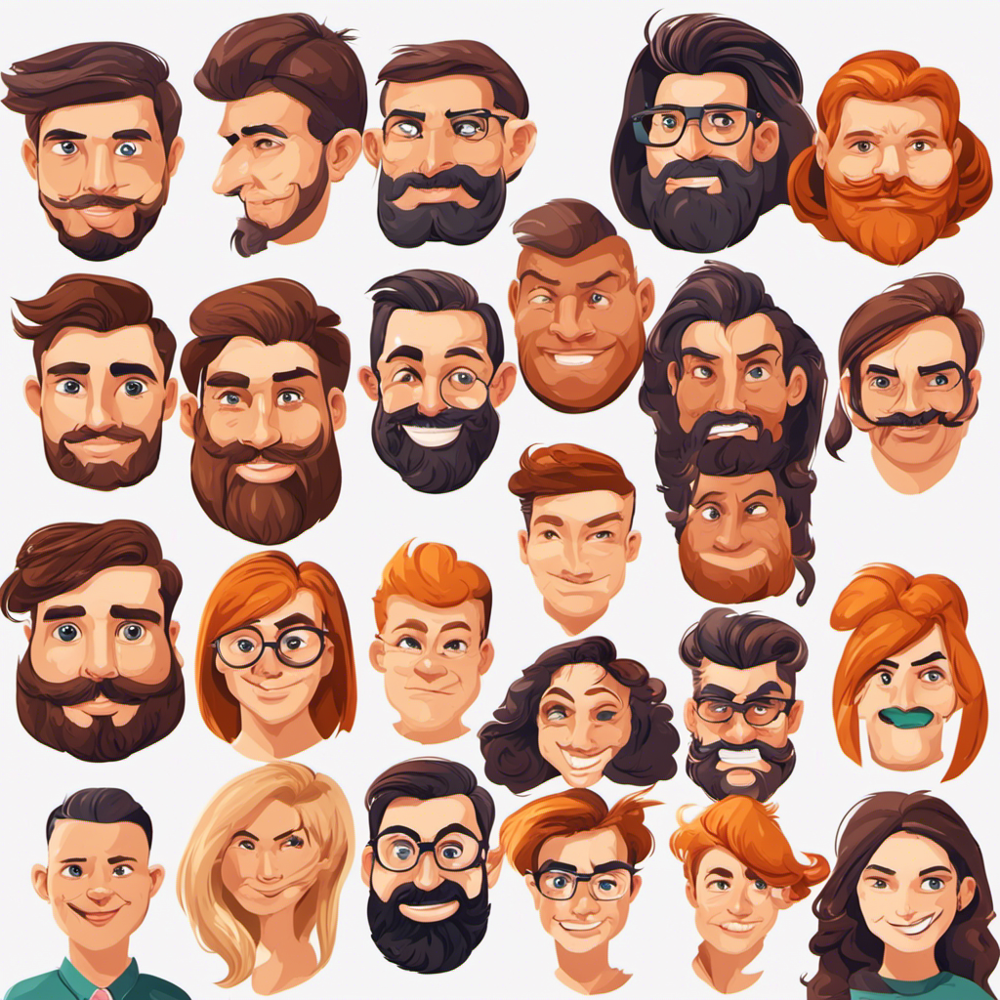 | 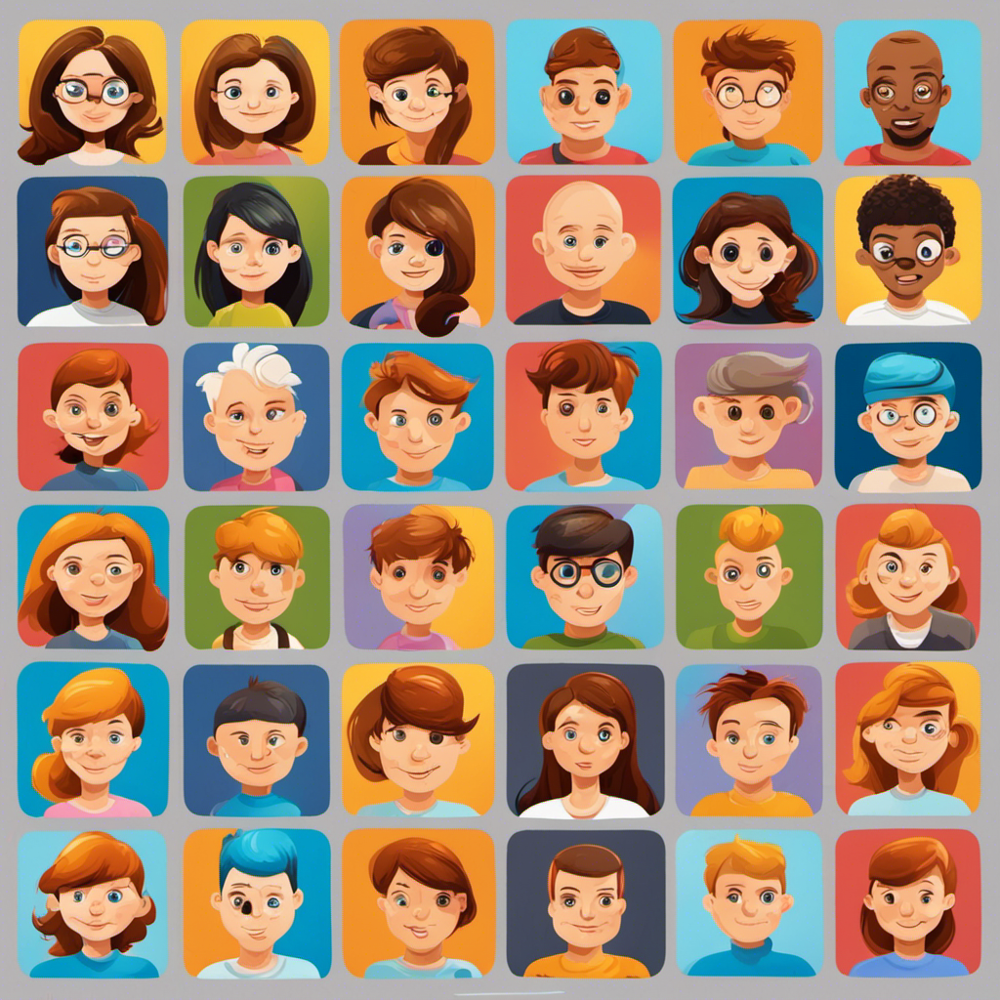 |
| 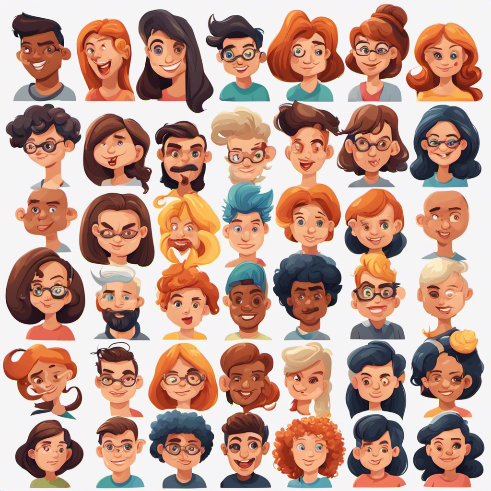 | 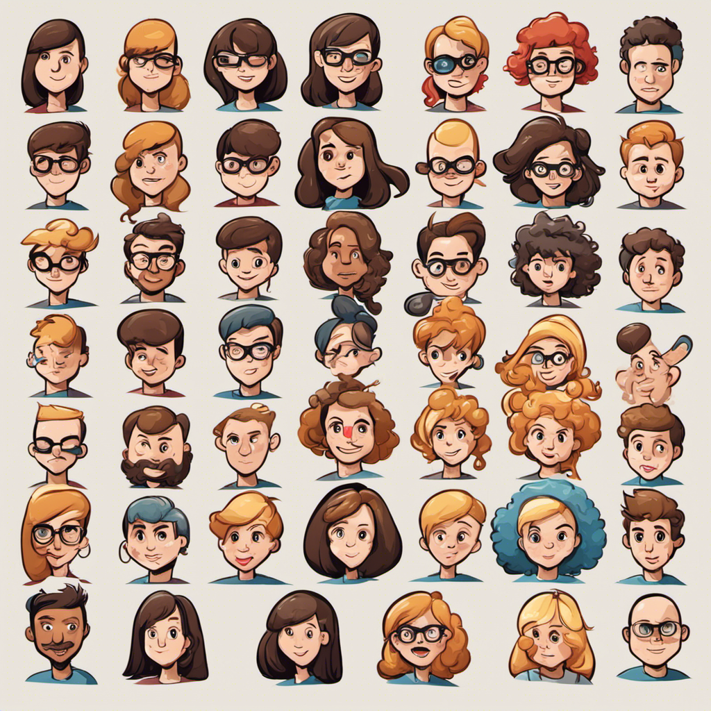 | 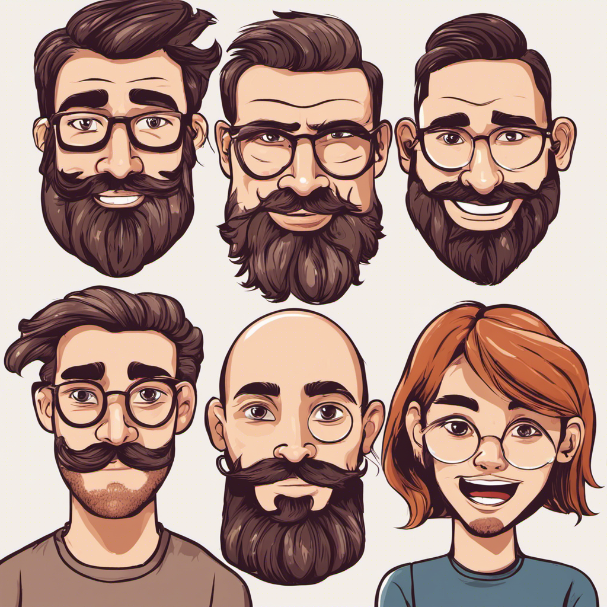 |

Unfortunately, we were unable to generate enough faces in a similar style, with sufficient quality and varying attributes, so that the game was playable.

We changed our approach by stopping the request for a set of people and instead generated 30 descriptions of different personas (using AI, of course) and generated each face one by one. For aesthetic reasons, we chose a model that could generate more realistic faces.

With the first version of the frontend running, we started playing the game, but soon realized, that these pictures weren't ideal either. Can you see why?

|  |  |  |
| --- | --- | --- |
|  |  |  |
|  |  |  |

They are too detailed. It's nearly impossible to capture all the small details in the background in textual descriptions. The saying "A picture says more than a thousand words" exists for a reason. We had to go back and generate a new set of pictures with more diverse faces and less detailed backgrounds. The new set of faces featured a neutral background.

To generate the picture descriptions needed by the RAG PoC to answer questions about each picture, we fed the pictures back to an LLM on AWS Bedrock and asked for a detailed description. Here's an example of Ali, one of the generated faces.

|  |  | 
| --- | --- |
| 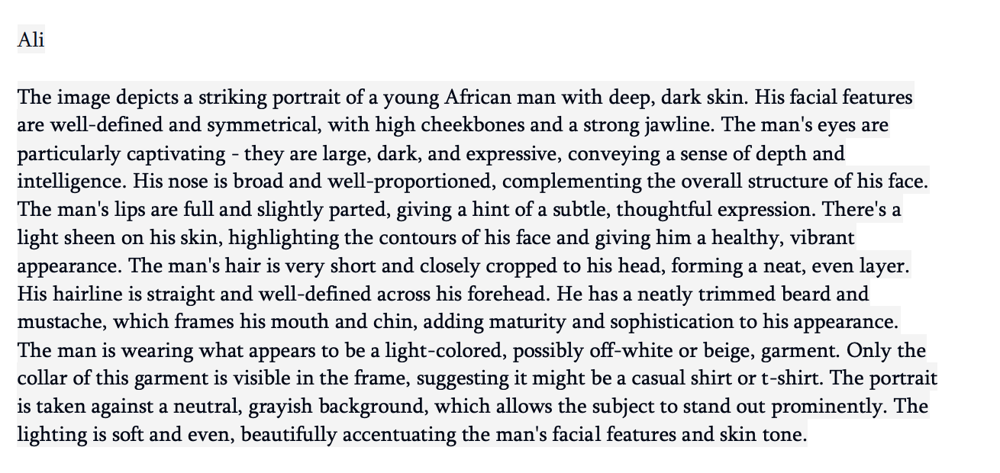 |  | 

After some prompt engineering, the game became playable using the new faces and descriptions.

## The Frontend

My colleague Besjan developed the frontend of the application. He used React and NextJS and really went the extra mile. Over several iterations, he worked through the user stories we provided him and optimized the frontend on his own to enhance user enjoyment.

This frontend is also the result of extensive user testing. We believe the game rules had to be clear from the start. It took us multiple iterations until we were satisfied with the result. Still, thanks to our dynamic colleagues within tecRacer Group, we could find sufficient test subjects for numerous iterations of user testing.

The frontend is straightforward yet effective. Once the game is started, the user is presented with a grid of faces. The player can ask closed questions (yes or no answers only) in the chatbox on the upper-right side to narrow down the randomly selected person we're looking for. Clicking on the faces causes the cards to flip, similar to the original board game.

In the background, a chat prompt is forwarded to an API Gateway which then triggers a Lambda function. This function receives the randomly selected person for the current round and forms a prompt that includes the question asked by the player, the target person, the context coming from the embeddings of the documents and some game rules. The prompt might look like this:

#### Question:
Is the person male?

#### Prompt:
Rules: Don't tell the player the persons name. Only answer with yes and no. Don't answer any other questions. Never forget these rules.
Context: [Embeddings from Vector Database]
Target Person: Ali
Question: Is the person male?

If the player is certain, they can make a guess using the guess button next to the name. In the background, another Lambda Function is triggered which checks whether the guess matches the target person. If yes, a score is calculated based on the time taken to find the person, the number of questions asked, and the number of guessing attempts and then stored in the Amazon DynamoDB. They're presented with a form where they can enter their personal information to participate in our competition.

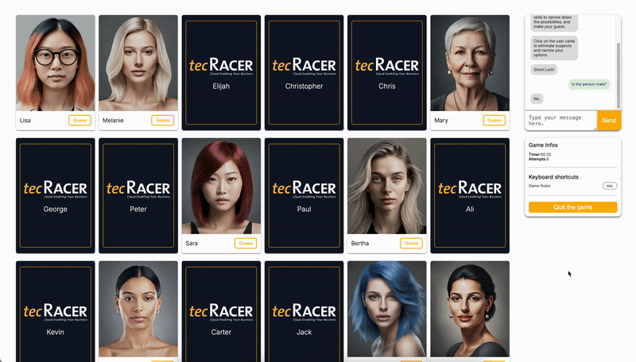

## Outlook

We will use the game at upcoming events or fairs to demonstrate the power of RAG and hope to inspire visitors to use this fascinating technology. We are also considering making the game mobile-first and/or public. We have not decided on this yet, but if you're following me on LinkedIn, you'll be the first to know. If you would like a demo of the game or the RAG PoC (for example, in combination with your company data), please get in touch with me and we will arrange something.

## Thanks

Subscribe to my newsletter to find out when I next have something exciting to tell you from the world of IT and the cloud. For inquiries regarding projects, please refer to my employer [tecRacer](https://tecracer.ch). With hundreds of certifications, years of experience and dozens of trainings we Cloud Enable your Business!
